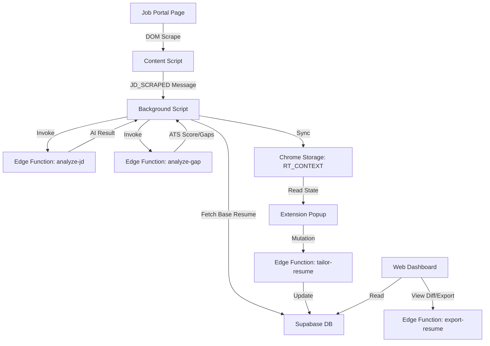

# ARCHITECTURE: ResumeTailor

## Folder Structure

| Path | Responsibility |
| :--- | :--- |
| `apps/extension` | Chrome Extension source code (Vite-based). |
| `apps/web` | React dashboard for managing resumes and history. |
| `packages/ui` | Shared design system using shadcn/ui and Tailwind. |
| `packages/types` | Unified TypeScript interfaces shared across apps and functions. |
| `packages/ai-pipeline` | Prompts, Zod schemas, and AI logic constants. |
| `supabase/migrations` | SQL files for database schema and RLS policies. |
| `supabase/functions` | Deno-based Edge Functions for Gemini AI and PDF export. |

## Data Flow

## APIs and External Services
- **Supabase Auth**: Google OAuth provider for both Web and Extension.
- **Supabase Database**: Postgres with RLS for storing `resumes` and `tailored_resumes`.
- **Supabase Storage**: Bucket `resumes` for original and tailored PDF/DOCX files.
- **Gemini API**: Used via `npm:@google/generative-ai` in Edge Functions for JD analysis, Gap analysis, and Tailoring.

## State Management
- **Zustand (`apps/web/src/store`)**: Manages web-side auth session.
- **TanStack Query**: Handles all server-state (Supabase fetches/mutations) with cache invalidation on both web and extension.
- **Chrome Storage (`RT_CONTEXT`)**: Acts as the single source of truth for the extension's "active application" context, allowing background scripts and the popup to stay in sync.

## Design Decisions
1. **Deno for AI Pipeline**: Gemini calls are moved to Edge Functions to keep API keys secure and leverage Deno's native support for `npm:` imports.
2. **Adapter Pattern for Scrapers**: Each job portal (LinkedIn, etc.) has its own class implementing `BaseAdapter`, making it trivial to add new sites.
3. **Structured AI Outputs**: All Gemini calls use `responseMimeType: "application/json"` with specific JSON schemas to ensure the pipeline is robust and type-safe.
4. **Monorepo for Types**: Sharing types between the Deno-based Edge Functions and the Vite-based apps ensures schema consistency.
